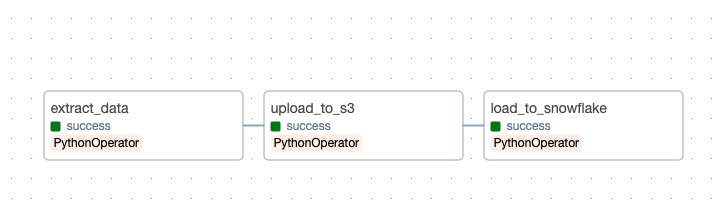

# Stori Data Engineering Challenge (español)
Este proyecto implementa un pipeline de datos robusto y orquestado que extrae información de una API pública, la procesa localmente, la almacena en AWS S3 y finalmente la ingesta en Snowflake.

Como se puede ver, los datos corresponden a los productos de una tienda de comercio, estos datos no están normalizados (3NF), si embargo, esto es una simulación de los datos que se pueden ingestar, por ejemplo, en una base de datos diseñada para OLTP. Esta solución sería, en todo caso, analysis-ready.

# Arquitectura del proyecto:
El flujo de datos sigue este orden:

- Extracción: API pública -> Archivo CSV.

- Almacenamiento: Archivo local -> AWS S3 (Particionado por fecha).

- Carga: AWS S3 -> Snowflake (External Stage).

- Orquestación: Todo el flujo es gestionado por Apache Airflow corriendo en Docker.

# Requisitos previos:
- Docker y Docker Compose instalados.

- Cuenta de AWS (S3 Bucket y credenciales IAM).

- Cuenta de Snowflake (Configurada con el script config.sql adjunto).

# Clonar el repo:

git clone <tu-repo-url>
cd stori_challenge

Variables de entorno (ejemplo):

# AWS
AWS_ACCESS_KEY=tu_key
AWS_SECRET_KEY=tu_secret
REGION_NAME=us-east-1
BUCKET_NAME=tu-bucket-stori

# Snowflake
SNOWFLAKE_USER=tu_usuario
SNOWFLAKE_PASSWORD=tu_password
SNOWFLAKE_ACCOUNT=tu_cuenta_id
SNOWFLAKE_WAREHOUSE=STORI_CHALLENGE_WH
SNOWFLAKE_DATABASE=STORI_CHALLENGE_DB
SNOWFLAKE_SCHEMA=STORI_CHALLENGE_BRONZE
SNOWFLAKE_TABLE_NAME=STORI_BRONZE
SNOWFLAKE_STAGE_NAME=STORI_STAGE

# Construcción del contenedor:
docker-compose up --build -d

# Cómo correr airflow:

Acceder a la interfaz de Airflow:
URL: http://localhost:8081 (notar que se movió el puerto por defecto)
Usuario: admin
Password: admin

# Estructura del repo:

dags/run_airflow.py: Definición de la orquestación y tareas.

scripts/: Módulos de lógica de negocio:

extraction.py: Conexión a API y transformación (Flattening).

to_s3.py: Lógica de carga a AWS S3.

to_snowflake.py: Lógica de ingesta a Snowflake.

config.sql: Script SQL para configurar el RBAC y objetos en Snowflake.

Dockerfile & docker-compose.yml: Configuración de la infraestructura como código.

# Retos de este acercamiento y posibles mejoras

Algunas cosas importantes referentes a este proyecto son las siguientes:

Archivo pasa por local: En el proceso de extracción, el archivo pasa por una ubicación local, lo cual puede consumir espacio y recursos. Una posible mejora es que nunca pase por local.
Chunksizing no funciona: En el proceso de extracción, el archivo pasa por un proceso de chunksizing (por temas de eficiencia). Sin embargo, al ser un objeto JSON, esto no es funcional (originalmente, esta clase estaba pensada para archivos tipo csv).
Grupos/carpetas en S3 inconsistentes: Dado que está pensada para una carga diaria, el bucket espera recibir datos nuevos, no ficheros ya procesados. Por lo que si hay algún cambio en los datos origen, el bucket no lo procesará, por lo que otros acercamientos son necesarios.
Tabla stage no flexible: Al tener problemas para hacer flexible la tabla de stage (bronze layer), se optó por seleccionar solamente las columnas de acuerdo a su posición. Si alguna columna, faltara o cambiara su posición, seguramente daría errores no deseados. Por lo tanto, es importantye agregar a la clase un INFER_SCHEMA para crear esta tabla de stage/bronze. 

# Ejemplo de éxito en runs de airflow

# Ejemplo de los datos ingestados

